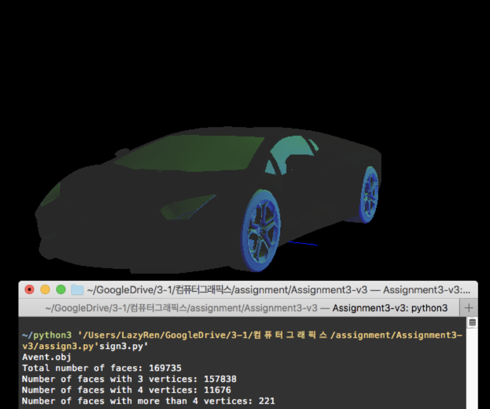
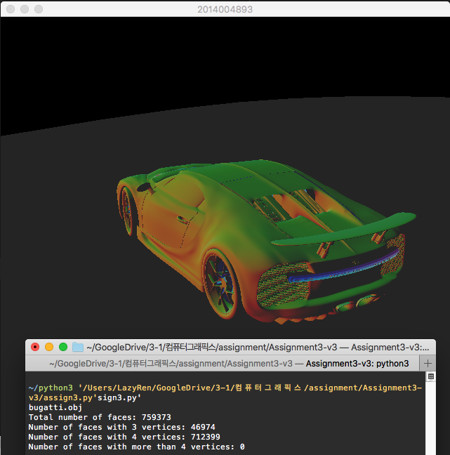
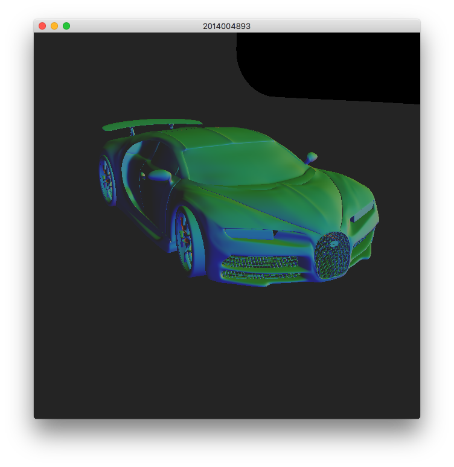
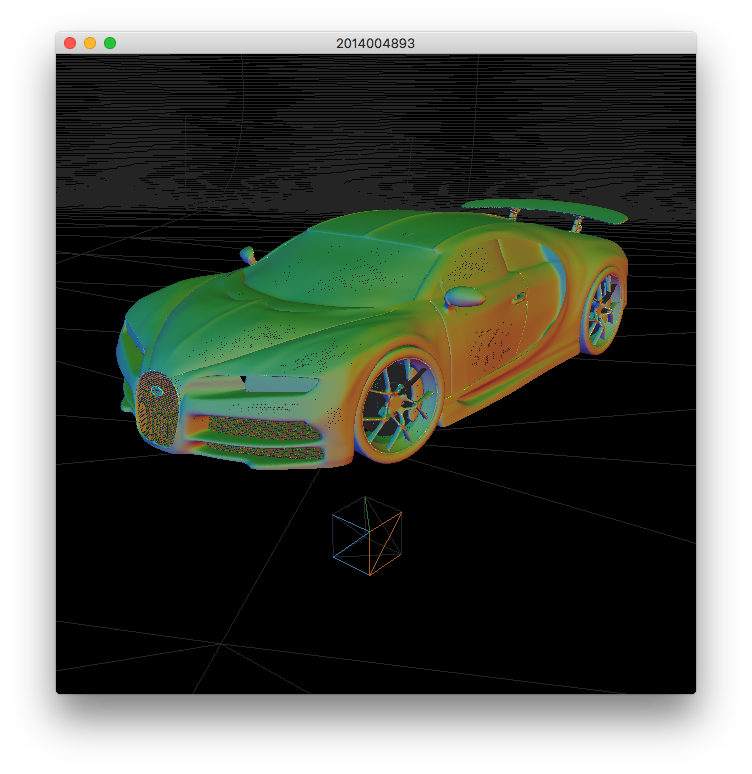

# OBJ Viewer

## How to Run

from terminal,

` python3 objviewer.py`

drag & drop any obj file you want to view.

## Implementation

drop_callback() function can load one obj file at a time. 
Note that drop_callback function return immediately  if you try

1. drop more than one file at a time
2. drop the same obj file that is being rendered at the moment
3. drop file that does not have 'obj' file extension

If the action does not match any of them above, function will starts to parse information from the file line by line.

## ScreenShots

